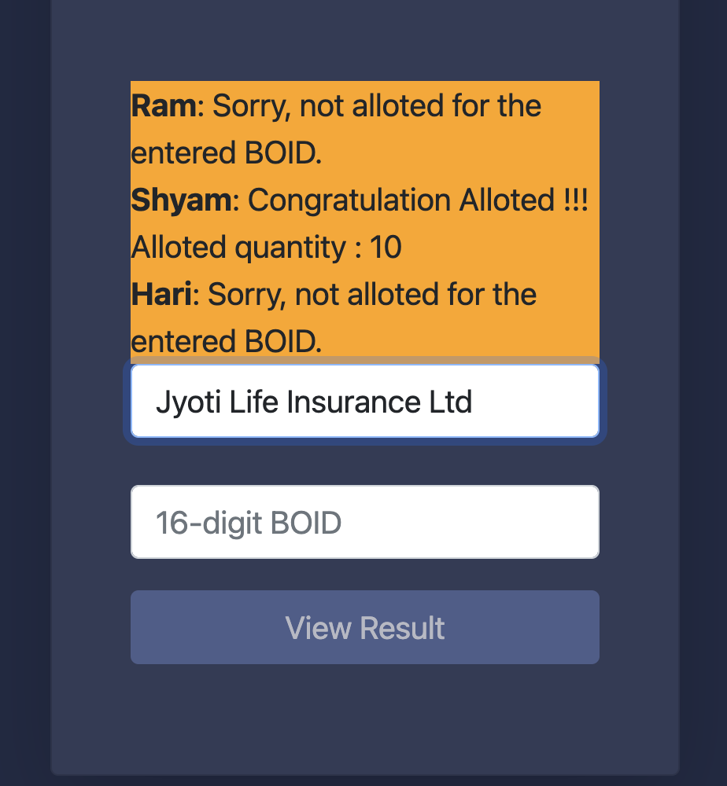

# Easy-IPO-Result-Finder
 This chrome extension would help you to see the IPO result in a much easier way.
 You need to manage the profile once and after that this extension would take care of the rest.
 Once you visit https://iporesult.cdsc.com.np/ this extension would be engaged and would fetch the result of selected company for all the profiles that is maintained.
 
 This extension is helpful to you iff you are maintaining multiple profiles.

## How to Use
1. Clone this repo
2. Open content.js file and change line#8 based on the profiles you would like to maintain.
3. Visit chrome://extensions in your chrome browser
4. Enable developer mode
5. Set Load unpacked button from the top left corner of the screen and select path to the clone repo.
6. Once upto steps 5 are followed, visit https://iporesult.cdsc.com.np/  and select the company for which you would like to find the IPO results of your maintained profile. The result would be displayed in the same page just above the drop-down list.

## Future Plan
Allow the profile to be maintained via the graphical user interface so that code changes have not to be done. This could be achieved by allowing user to enter the value via an extension and storing them in local storage.

## Sample Screenshot

